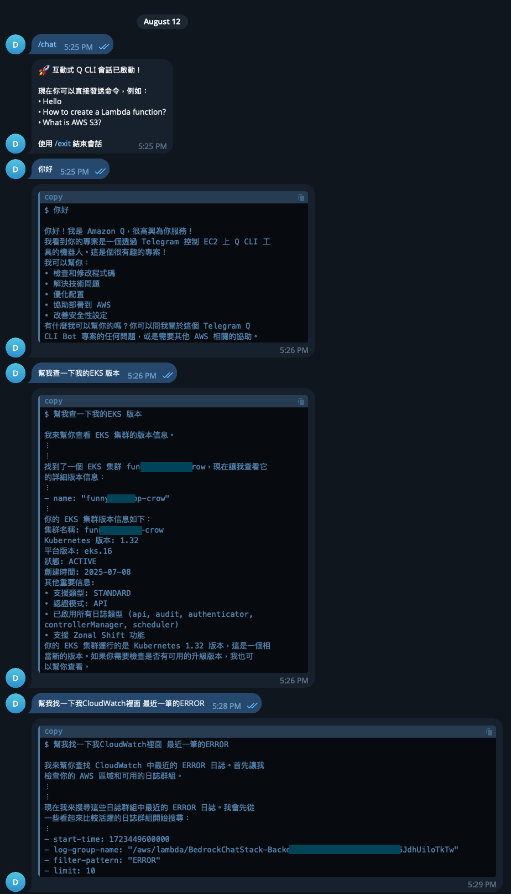

# Amazon Q CLI Telegram Bot

🤖 透過 Telegram 與 Amazon Q CLI 互動的智能機器人，讓你可以在任何地方使用 Telegram 來查詢 AWS 資源、獲得技術建議，並執行各種 Q CLI 功能，例如MCP。

## ✨ 功能特色

- 🚀 **互動式會話**: 支援持續對話，就像在終端中使用 Q CLI 一樣
- 🔍 **智能進度提示**: 根據查詢類型顯示相應的進度訊息（EKS、EC2、RDS 等）
- 📱 **終端風格輸出**: 清潔的程式碼區塊格式，模擬真實終端體驗
- 📄 **長訊息分割**: 自動分割長回應為多個易讀的訊息
- 🔒 **用戶權限控制**: 限制特定用戶使用，確保安全性
- ⏱️ **智能超時處理**: 2分鐘超時限制，適合複雜的 AWS 查詢
- 🧹 **ANSI 清理**: 自動清理終端控制字符，確保乾淨輸出
- 📝 **詳細日誌**: 完整的操作記錄和錯誤追蹤

## ✨功能展示



## 🎯 使用場景

- **AWS 資源管理**: 隨時隨地查詢 EC2、EKS、RDS、Lambda 等資源狀態
- **MCP伺服器**: 可以整合各種MCP Server應用於各種場景
- **技術諮詢**: 獲得 AWS 最佳實踐建議和技術指導
- **故障排除**: 快速診斷和解決 AWS 相關問題
- **學習輔助**: 學習 AWS 服務和最佳實踐
- **團隊協作**: 團隊成員可以共享 AWS 查詢和建議

## 🚀 快速開始

### 1. 環境準備

確保你的系統已安裝：
- **Python 3.7+**
- **Amazon Q CLI** ([安裝指南](https://docs.aws.amazon.com/amazonq/latest/qdeveloper-ug/command-line-getting-started-installing.html))
- **pip3**

### 2. 安裝專案

```bash
# Clone專案
git clone https://github.com/hoycdanny/amazon-q-hub-with-telegram.git
cd amazon-q-hub-with-telegram

# 安裝依賴
pip3 install -r requirements.txt
```

### 3. 創建 Telegram Bot

1. 在 Telegram 中搜尋 [@BotFather](https://t.me/BotFather)
2. 發送 `/newbot` 命令
3. 按照指示設定機器人名稱和用戶名
4. 複製取得的 **Bot Token**

### 4. 配置環境

```bash
# 複製配置範例
cp .env.example .env

# 編輯配置檔案
vim .env
```

在 `.env` 檔案中填入：
```env
# 你的 Telegram Bot Token (參考 3. 創建 Telegram Bot)
BOT_TOKEN=your_bot_token_here

# 允許使用的用戶 ID（可透過 @userinfobot 取得）
ALLOWED_USERS=123456789,987654321

# Q CLI 路徑（留空會自動尋找）
Q_CLI_PATH=

# 超時時間（秒）
TIMEOUT=120
```

### 5. 啟動機器人

```bash
python3 telegram_q_bot.py
```

## 📱 使用方法

### 基本命令

| 命令 | 說明 |
|------|------|
| `/start` | 顯示歡迎訊息和使用說明 |
| `/status` | 檢查 Q CLI 狀態和版本 |
| `/chat` | 開始互動式會話 |
| `/exit` | 結束互動式會話 |
| `/q <命令>` | 執行單次 Q CLI 命令 |

### 互動式會話

```
👤 你: /chat
🤖 Bot: 🚀 互動式 Q CLI 會話已啟動！

👤 你: 你好
🤖 Bot: 🔍 正在查詢...
```

### 使用範例

#### AWS 資源查詢
```
👤 你: 檢查我的 EC2 實例狀態
🤖 Bot: 🖥️ 正在查詢 EC2 實例...

👤 你: 顯示我的 EKS 集群資訊
🤖 Bot: 🔍 正在查詢 EKS 集群資訊...

👤 你: 列出我的 RDS 資料庫
🤖 Bot: 🗄️ 正在查詢 RDS 資料庫...
```

#### 技術諮詢
```
👤 你: How to create a Lambda function?
🤖 Bot: 🤔 正在思考...

👤 你: What are the best practices for EKS security?
🤖 Bot: 🤔 正在思考...
```


## 🔧 故障排除

### 常見問題

#### Q CLI 找不到
```bash
# 檢查 Q CLI 安裝
which q
q --version

# 如果未安裝，請參考官方安裝指南
```

#### 機器人無回應
1. 檢查 Bot Token 是否正確
2. 確認網路連線正常
3. 查看終端日誌輸出
4. 確認只有一個機器人實例在運行

#### 權限被拒絕
1. 確認你的 Telegram 用戶 ID 在 `ALLOWED_USERS` 中
2. 可透過 [@userinfobot](https://t.me/userinfobot) 取得用戶 ID

#### 命令超時
- 複雜的 AWS 查詢可能需要較長時間
- 可在 `.env` 中調整 `TIMEOUT` 值
- 檢查 AWS 憑證和網路連線

### 日誌查看

```bash
# 查看即時日誌
tail -f /var/log/telegram-q-cli-bot.log

# 查看系統服務日誌
sudo journalctl -u telegram-q-cli-bot -f
```


## 🤝 貢獻

歡迎提交 Issue 和 Pull Request！

1. Fork 此專案
2. 創建功能分支 (`git checkout -b feature/amazing-feature`)
3. 提交變更 (`git commit -m 'Add amazing feature'`)
4. 推送到分支 (`git push origin feature/amazing-feature`)
5. 開啟 Pull Request

